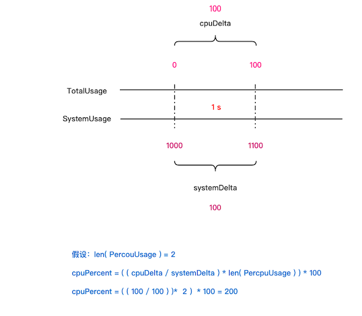
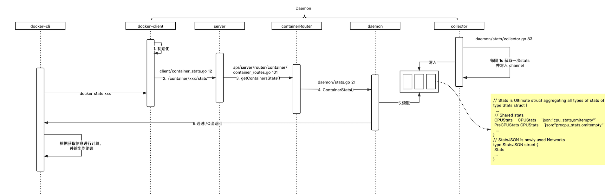

## Docker stats

[源码位置](https://github.com/moby/moby/blob/c6134474c264714cfab9512dbe425f61a750ea9e/integration-cli/docker_api_stats_test.go#L36-L47)


### 1. 基本概念


#### types.Stats

```go
// Stats is Ultimate struct aggregating all types of stats of one container
type Stats struct {
	...

	// Shared stats
	CPUStats    CPUStats    `json:"cpu_stats,omitempty"`
	PreCPUStats CPUStats    `json:"precpu_stats,omitempty"` // "Pre"="Previous"
	MemoryStats MemoryStats `json:"memory_stats,omitempty"`
}
```


#### CPUStats

```go
// CPUStats aggregates and wraps all CPU related info of container
type CPUStats struct {
	// CPU Usage. Linux and Windows.
	CPUUsage CPUUsage `json:"cpu_usage"`

	// System Usage. Linux only.
	SystemUsage uint64 `json:"system_cpu_usage,omitempty"`
  
  // Online CPUs. Linux only.
	OnlineCPUs uint32 `json:"online_cpus,omitempty"`
	...
}
```


#### CPUUsage

```go
// CPUUsage stores All CPU stats aggregated since container inception.
type CPUUsage struct {
	// Total CPU time consumed.
	// Units: nanoseconds (Linux)
	// Units: 100's of nanoseconds (Windows)
	TotalUsage uint64 `json:"total_usage"`

	// Total CPU time consumed per core (Linux). Not used on Windows.
	// Units: nanoseconds.
	PercpuUsage []uint64 `json:"percpu_usage,omitempty"`
	...
}
```


#### Linux 下的计算逻辑

```go
func calculateCPUPercentUnix(previousCPU, previousSystem uint64, v *types.StatsJSON) float64 {
	var (
		cpuPercent = 0.0
		// calculate the change for the cpu usage of the container in between readings
		cpuDelta = float64(v.CPUStats.CPUUsage.TotalUsage) - float64(previousCPU)
		// calculate the change for the entire system between readings
		systemDelta = float64(v.CPUStats.SystemUsage) - float64(previousSystem)
		onlineCPUs  = float64(v.CPUStats.OnlineCPUs)
	)

	if onlineCPUs == 0.0 {
		onlineCPUs = float64(len(v.CPUStats.CPUUsage.PercpuUsage))
	}
	if systemDelta > 0.0 && cpuDelta > 0.0 {
		cpuPercent = (cpuDelta / systemDelta) * onlineCPUs * 100.0
	}
	return cpuPercent
}
```


#### 计算原理




#### 请求流程




#### collector 数据获取

##### cpu_total_usage

从该文件`sys/fs/cgroup/cpuacct/docker/[containerId]/cpuacct.usage`获取

##### system_usage

读取`/proc/stat`中cpu field value，并进行累加

##### per_cpu_usage_array

从该文件`/sys/fs/cgroup/cpuacct/docker/[containerId]/cpuacct.usage_percpu`获取

