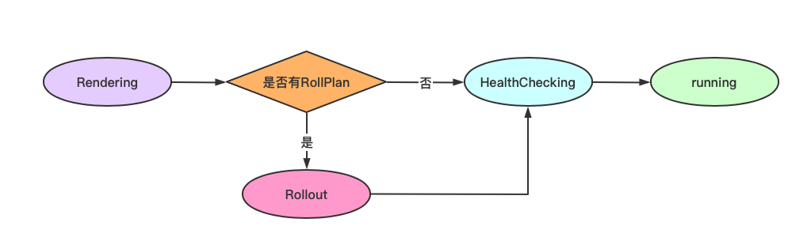

## Application


### 1. Application CRD


#### 1.1 ApplicationSpec

ApplicationSpec 是对于 Applicatioin 的声明。主要包含两个部分：Commponents 和 RollloutPlan。

```go
// ApplicationSpec is the spec of Application
type ApplicationSpec struct {
	Components []ApplicationComponent `json:"components"`

	// RolloutPlan is the details on how to rollout the resources
	RolloutPlan *v1alpha1.RolloutPlan `json:"rolloutPlan,omitempty"`
}
```

**Components** 代表该应用中的所有 Component，每一个 Component 对应一个微服务或一个中间件（如：mysql ）。

**RolloutPlan** 是该应用滚动更新的策略。


##### ApplicationComponent

`ApplicationComponent` 中包含应用中每一个 Component 的信息。

```go
// ApplicationComponent describe the component of application
type ApplicationComponent struct {
  // Component 的名称
	Name string `json:"name"`
  // Component 的类型 - 对应 ComponetDefinition 的名称
	Type string `json:"type"`
	// Component 需要传入的参数
	Properties runtime.RawExtension `json:"properties,omitempty"`

	// Traits define the trait of one component, the type must be array to keep the order.
  // Component 中所有的 Traits
	Traits []ApplicationTrait `json:"traits,omitempty"`

	// scopes in ApplicationComponent defines the component-level scopes
	// the format is <scope-type:scope-instance-name> pairs, the key represents type of `ScopeDefinition` while the value represent the name of scope instance.
	Scopes map[string]string `json:"scopes,omitempty"`
}
```


`RolloutPlan` 代表着该应用滚动更新的策略。

```go
// RolloutPlan fines the details of the rollout plan
type RolloutPlan struct {

	// RolloutStrategy defines strategies for the rollout plan
	// The default is IncreaseFirstRolloutStrategyType
	// [IncreaseFirst, DecreaseFirst]
	RolloutStrategy RolloutStrategyType `json:"rolloutStrategy,omitempty"`

	// The size of the target resource. The default is the same
	// as the size of the source resource.
	// +optional
	TargetSize *int32 `json:"targetSize,omitempty"`

	// The number of batches, default = 1
	// +optional
	NumBatches *int32 `json:"numBatches,omitempty"`

	// The exact distribution among batches.
	// its size has to be exactly the same as the NumBatches (if set)
	// The total number cannot exceed the targetSize or the size of the source resource
	// We will IGNORE the last batch's replica field if it's a percentage since round errors can lead to inaccurate sum
	// We highly recommend to leave the last batch's replica field empty
	// +optional
	RolloutBatches []RolloutBatch `json:"rolloutBatches,omitempty"`

	// All pods in the batches up to the batchPartition (included) will have
	// the target resource specification while the rest still have the source resource
	// This is designed for the operators to manually rollout
	// Default is the the number of batches which will rollout all the batches
	// +optional
	BatchPartition *int32 `json:"batchPartition,omitempty"`

	// Paused the rollout, default is false
	// +optional
	Paused bool `json:"paused,omitempty"`

	// RolloutWebhooks provide a way for the rollout to interact with an external process
	// +optional
	RolloutWebhooks []RolloutWebhook `json:"rolloutWebhooks,omitempty"`

	// CanaryMetric provides a way for the rollout process to automatically check certain metrics
	// before complete the process
	// +optional
	CanaryMetric []CanaryMetric `json:"canaryMetric,omitempty"`
}
```


#### 1.2 AppStatus

```go
// AppStatus defines the observed state of Application
type AppStatus struct {
	// INSERT ADDITIONAL STATUS FIELD - define observed state of cluster
	// Important: Run "make" to regenerate code after modifying this file
	runtimev1alpha1.ConditionedStatus `json:",inline"`

	Rollout AppRolloutStatus `json:"rollout,omitempty"`

	Phase ApplicationPhase `json:"status,omitempty"`

	// Components record the related Components created by Application Controller
	Components []runtimev1alpha1.TypedReference `json:"components,omitempty"`

	// Services record the status of the application services
	Services []ApplicationComponentStatus `json:"services,omitempty"`

	// ResourceTracker record the status of the ResourceTracker
	ResourceTracker *runtimev1alpha1.TypedReference `json:"resourceTracker,omitempty"`

	// LatestRevision of the application configuration it generates
	// +optional
	LatestRevision *Revision `json:"latestRevision,omitempty"`
}
```


### 2. Application Controller

#### 2.1 状态

##### Application 状态

```go
// ApplicationPhase is a label for the condition of a application at the current time
type ApplicationPhase string

const (
	// ApplicationRollingOut means the app is in the middle of rolling out
	ApplicationRollingOut ApplicationPhase = "rollingOut"
	// ApplicationRendering means the app is rendering
	ApplicationRendering ApplicationPhase = "rendering"
	// ApplicationRunning means the app finished rendering and applied result to the cluster
	ApplicationRunning ApplicationPhase = "running"
	// ApplicationHealthChecking means the app finished rendering and applied result to the cluster, but still unhealthy
	ApplicationHealthChecking ApplicationPhase = "healthChecking"
)
```




<center><b>Application 状态切换</b></center>


##### Component 状态

```go
// ApplicationComponentStatus record the health status of App component
type ApplicationComponentStatus struct {
	Name string `json:"name"`
	// WorkloadDefinition is the definition of a WorkloadDefinition, such as deployments/apps.v1
	WorkloadDefinition WorkloadGVK                      `json:"workloadDefinition,omitempty"`
	Healthy            bool                             `json:"healthy"`
	Message            string                           `json:"message,omitempty"`
	Traits             []ApplicationTraitStatus         `json:"traits,omitempty"`
	Scopes             []runtimev1alpha1.TypedReference `json:"scopes,omitempty"`
}
```

##### Rollout 状态

```go
// RolloutStatus defines the observed state of a rollout plan
type RolloutStatus struct {
	// Conditions represents the latest available observations of a CloneSet's current state.
	runtimev1alpha1.ConditionedStatus `json:",inline"`

	// RolloutTargetSize is the size of the target resources. This is determined once the initial spec verification
	// and does not change until the rollout is restarted
	RolloutOriginalSize int32 `json:"rolloutOriginalSize,omitempty"`

	// RolloutTargetSize is the size of the target resources. This is determined once the initial spec verification
	// and does not change until the rollout is restarted
	RolloutTargetSize int32 `json:"rolloutTargetSize,omitempty"`

	// NewPodTemplateIdentifier is a string that uniquely represent the new pod template
	// each workload type could use different ways to identify that so we cannot compare between resources
	NewPodTemplateIdentifier string `json:"targetGeneration,omitempty"`

	// lastAppliedPodTemplateIdentifier is a string that uniquely represent the last pod template
	// each workload type could use different ways to identify that so we cannot compare between resources
	// We update this field only after a successful rollout
	LastAppliedPodTemplateIdentifier string `json:"lastAppliedPodTemplateIdentifier,omitempty"`

	// RollingState is the Rollout State
	RollingState RollingState `json:"rollingState"`

	// BatchRollingState only meaningful when the Status is rolling
	// +optional
	BatchRollingState BatchRollingState `json:"batchRollingState"`

	// The current batch the rollout is working on/blocked
	// it starts from 0
	CurrentBatch int32 `json:"currentBatch"`

	// UpgradedReplicas is the number of Pods upgraded by the rollout controller
	UpgradedReplicas int32 `json:"upgradedReplicas"`

	// UpgradedReadyReplicas is the number of Pods upgraded by the rollout controller that have a Ready Condition.
	UpgradedReadyReplicas int32 `json:"upgradedReadyReplicas"`
}
```


#### 2.2 Application 状态切换时发送的事件信息

##### Application Event 

```go
// reason for Application
const (
	ReasonParsed      = "Parsed"
	ReasonRendered    = "Rendered"
	ReasonApplied     = "Applied"
	ReasonHealthCheck = "HealthChecked"
	ReasonDeployed    = "Deployed"
	ReasonRollout     = "Rollout"

	ReasonFailedParse       = "FailedParse"
	ReasonFailedRender      = "FailedRender"
	ReasonFailedApply       = "FailedApply"
	ReasonFailedHealthCheck = "FailedHealthCheck"
	ReasonFailedGC          = "FailedGC"
	ReasonFailedRollout     = "FailedRollout"
)

// event message for Application
const (	
	MessageParsed      = "Parsed successfully"
	MessageRendered    = "Rendered successfully"
	MessageApplied     = "Applied successfully"
	MessageHealthCheck = "Health checked healthy"
	MessageDeployed    = "Deployed successfully"
	MessageRollout     = "Rollout successfully"
  
  MessageFailedParse       = "fail to parse application, err: %v"
	MessageFailedRender      = "fail to render application, err: %v"
	MessageFailedApply       = "fail to apply component, err: %v"
	MessageFailedHealthCheck = "fail to health check, err: %v"
	MessageFailedGC          = "fail to garbage collection, err: %v"
)
```


#### 2.3 Conditions

