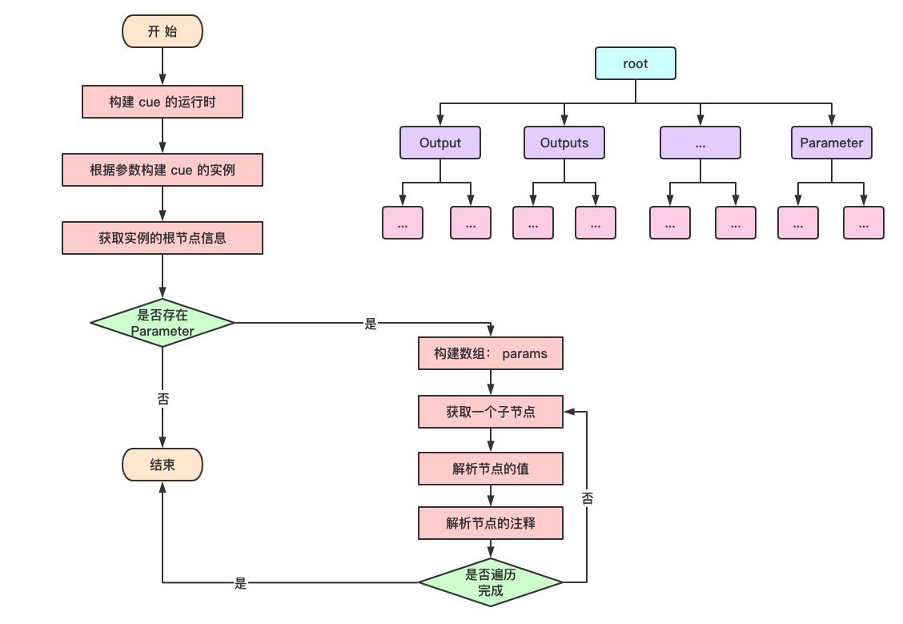

## 1. pkg/cue

`pkg/cue` 是 kubevela 对 cue 的一个基本封装。

主要有两个文件：`base_template.go` 和 `convert.go`。

### 1.1 base_template.go

```go
// BaseTemplate include base info provided by KubeVela for CUE template
const BaseTemplate = `

context: {
  name: string
  config?: [...{
    name: string
    value: string
  }]
}
`
```

该文件中主要包括一个 `context` 的声明。


### 1.2 cuelang

在阅读代码之前，需要先了解 `cuelang` 中的一些内容：

##### type

- cue.Runtime{}
- cue.FieldInfo
- cue.Kind
- cue.Value
- cue.Instance

##### const

- cue.IntKind
- cue.StringKind
- cue.BoolKind
- cue.NumberKind
- cue.FloatKind


#### cue.Runtime{} 

```go
// A Runtime is used for creating CUE interpretations.
//
// Any operation that involves two Values or Instances should originate from
// the same Runtime.
//
// The zero value of a Runtime is ready to use.
type Runtime struct {
	ctx *build.Context // TODO: remove
	idx *index
}
```

#### cue.Instance

```go
// An Instance defines a single configuration based on a collection of
// underlying CUE files.
type Instance struct {
	*index

	rootStruct *structLit // the struct to insert root values into
	rootValue  value      // the value to evaluate: may add comprehensions

	// scope is used as an additional top-level scope between the package scope
	// and the predeclared identifiers.
	scope *structLit

	ImportPath  string
	Dir         string
	PkgName     string
	DisplayName string

	Incomplete bool         // true if Pkg and all its dependencies are free of errors
	Err        errors.Error // non-nil if the package had errors

	inst *build.Instance

	complete bool // for cycle detection
}
```


#### cue.FieldInfo

```go
// FieldInfo contains information about a struct field.
type FieldInfo struct {
	Name  string
	Pos   int
	Value Value

	IsDefinition bool
	IsOptional   bool
	IsHidden     bool
}
```


#### cue.Value

```go
// Value holds any value, which may be a Boolean, Error, List, Null, Number,
// Struct, or String.
type Value struct {
	idx  *index
	path *valueData
}
```


#### cue.Kind

```go
// Kind determines the underlying type of a Value.
type Kind int

const BottomKind Kind = 0

const (
	// NullKind indicates a null value.
	NullKind Kind = 1 << iota // 1

	// BoolKind indicates a boolean value.
	BoolKind // 2

	// IntKind represents an integral number.
	IntKind // 4

	// FloatKind represents a decimal float point number that cannot be
	// converted to an integer. The underlying number may still be integral,
	// but resulting from an operation that enforces the float type.
	FloatKind // 8

	// StringKind indicates any kind of string.
	StringKind // 16

	// BytesKind is a blob of data.
	BytesKind // 32

	// StructKind is a kev-value map.
	StructKind // 64

	// ListKind indicates a list of values.
	ListKind // 128

	nextKind // 256

	// _numberKind is used as a implementation detail inside
	// Kind.String to indicate NumberKind.
	_numberKind // 512

	// NumberKind represents any kind of number.
  // 0000 0100 | 0000 1000 = 0000 1100
	NumberKind = IntKind | FloatKind  // 12
)
```


### 1.3 convert.go

在 `convert.go` 中有三个主要的方法 `GetParameters`、`GetDefault` 和 `RetrieveComments`。

#### GetParameters

```go
// ParameterTag is the keyword in CUE template to define users' input
var ParameterTag = "parameter"

// GetParameters get parameter from cue template
func GetParameters(templateStr string) ([]types.Parameter, error) {
  // 构建 cue 的运行时
	r := cue.Runtime{}
  // 构建 cue 实例
	template, err := r.Compile("", templateStr+BaseTemplate)
	...
	tempStruct, err := template.Value().Struct()
	...
	// 遍历实例，获取 Parameter
	var paraDef cue.FieldInfo
	var found bool
	for i := 0; i < tempStruct.Len(); i++ {
		paraDef = tempStruct.Field(i)
		if paraDef.Name == ParameterTag {
			found = true
			break
		}
	}
	...
	arguments, err := paraDef.Value.Struct()
	...
	// 遍历解析 Parameter
	var params []types.Parameter
	for i := 0; i < arguments.Len(); i++ {
		...
    	param.Default = GetDefault(def)
		...
    // 获取 Parameter 的注释信息
		param.Short, param.Usage, param.Alias = RetrieveComments(val)
		params = append(params, param)
	}
	return params, nil
}
```


#### GetDefault

`GetDefault` 函数用于获取值。

```go
// GetDefault evaluate default Go value from CUE
func GetDefault(val cue.Value) interface{} {
	// nolint:exhaustive
	switch val.Kind() {
	case cue.IntKind:
		if d, err := val.Int64(); err == nil {
			return d
		}
	case cue.StringKind:
		if d, err := val.String(); err == nil {
			return d
		}
	case cue.BoolKind:
		if d, err := val.Bool(); err == nil {
			return d
		}
	case cue.NumberKind, cue.FloatKind:
		if d, err := val.Float64(); err == nil {
			return d
		}
	default:
	}
	return getDefaultByKind(val.Kind())
}
```


#### RetrieveComments

`RetrieveComments` 函数用于提取 `Parameter` 中的注释

```go
const (
	// UsagePrefix defines the usage display for KubeVela CLI
	UsagePrefix = "+usage="
	// ShortPrefix defines the short argument for KubeVela CLI
	ShortPrefix = "+short="
	// AliasPrefix is an alias of the name of a parameter element, in order to making it more friendly to Cli users
	AliasPrefix = "+alias="
)

// RetrieveComments will retrieve Usage, Short and Alias from CUE Value
func RetrieveComments(value cue.Value) (string, string, string) {
	var short, usage, alias string
	docs := value.Doc()
	for _, doc := range docs {
		lines := strings.Split(doc.Text(), "\n")
		for _, line := range lines {
			line = strings.TrimSpace(line)
			line = strings.TrimPrefix(line, "//")
			line = strings.TrimSpace(line)
			if strings.HasPrefix(line, ShortPrefix) {
				short = strings.TrimPrefix(line, ShortPrefix)
			}
			if strings.HasPrefix(line, UsagePrefix) {
				usage = strings.TrimPrefix(line, UsagePrefix)
			}
			if strings.HasPrefix(line, AliasPrefix) {
				alias = strings.TrimPrefix(line, AliasPrefix)
			}
		}
	}
	return short, usage, alias
}
```


### 1.4 总结

整个 `convert.go` 的主要功能就是从一个 `cue` 实例中解析出 `Parameter` 相关的信息。




