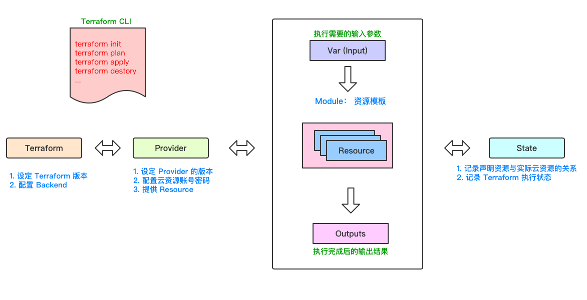
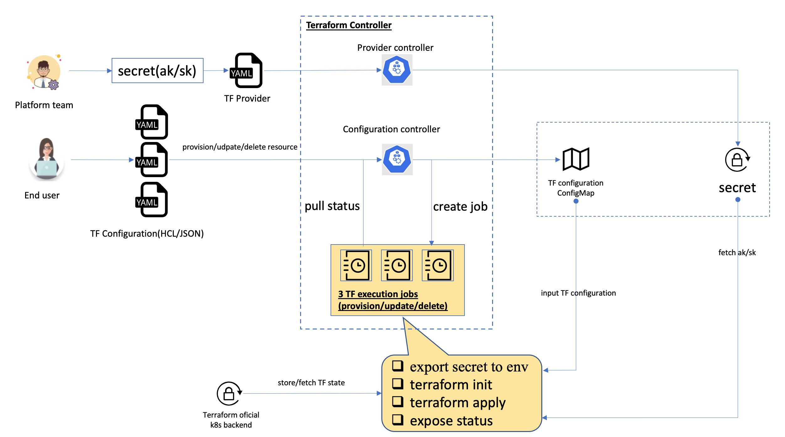
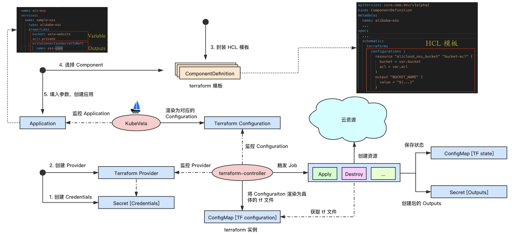

## Terraform 服务化

### 1. Terraform 的基本架构



<center><b>图 1：Terraform基本架构</b></center>

#### Terraform CLI

terraform 命令行工具是 terraform 的一个重要组件。客户端通过解析 tf 文件，来获取具体的云资源对象，同时根据命令对云资源对象进行相关操作，并将执行结果记录在状态文件中。

[Terraform CLI Documentatioin](https://www.terraform.io/docs/cli/index.html)


#### Terraform

tf 文件中的 terraform 对象用于配置 terraform 自身行为，如：terraform 版本，backend 配置，对于Provider的要求。

```tf
terraform {
	# terraform 版本限制
	version = ">= 1.2.0, < 2.0.0"
	
	# backend - local
	backend "local" {
		path = "relative/path/to/terraform.tfstate"
	}
	
	# backend -remote
	backend "remote" {
		hostname = app.terraform.io"
		organization = "company"
		
		workspaces {
			prefix = "my-app-"
		}
	}
	
	# provider 要求
	required_providers {
		aws = {
			version = ">= 2.7.8"
			source = "hashicorp/aws"
		}
	}
}
```


### Provider

Provider 代表 terraform 要去连接的远程云资源服务。

```tf
# provider google
provider "google" {
  project = "acme-app"
  region  = "us-central1"
}

# provider alibaba
provider "alicloud" {
  access_key = "${var.access_key}"
  secret_key = "${var.secret_key}"
  region     = "${var.region}"
}
```


### Variable

Variable 表示资源对象声明的变量，可以通过修改变量的值来生成不同的云资源。


### Modules

Modules是多个资源的集合。一个 Module 包含了一系列的 `.tf` 文件。


### Outputs

Output 声明了 terraform 客户端命令执行完成后，需要返回的信息。

```tf
output "instance_ip_addr" {
  value = aws_instance.server.private_ip
}
```


### State

用于记录 terraform 的执行状态。


### 2. 一个完整的服务请求要解决的问题

- Provider 如何管理  <-----> Provider 同步 | Provider 版本  | Provider Credentials (账号、密码)
- 如何管理状态文件 <----->  Terraform version | Terraform backend
- 如何管理云资源模板  <-----> terraform 模板文件以什么形式存放 
- 如何管理变量 <-----> 如何抽离变量，同时在赋值完成后，将变量合并到整个配置文件中
- 执行 terraform init , terraform apply | destroy 命令


### 3. terraform-controller 的实践



#### 3.1 Provider 资源对象

##### Provider

```go
// ProviderSpec defines the desired state of Provider.
type ProviderSpec struct {
	// Provider is the cloud service provider, like `alibaba`
	Provider string `json:"provider"`

	// Region is cloud provider's region
	Region string `json:"region"`

	// Credentials required to authenticate to this provider.
	Credentials ProviderCredentials `json:"credentials"`
}

// ProviderCredentials required to authenticate.
type ProviderCredentials struct {
	// Source of the provider credentials.
	// +kubebuilder:validation:Enum=None;Secret;InjectedIdentity;Environment;Filesystem
	Source types.CredentialsSource `json:"source"`

	// A SecretRef is a reference to a secret key that contains the credentials
	// that must be used to connect to the provider.
	// +optional
	SecretRef *types.SecretKeySelector `json:"secretRef,omitempty"`
}
```

在 terraform-controller 中，Provider 资源对象包含三个字段：`Provider`、 `Region` 和 `Credentials`。

Provider: 设置云服务厂商的 Provider, 如 alicloud

Region: 代表资源创建出来后所在的 Region.

Credentials: 存储Provider的授权证书，保证 terraform 有操作云资源的权限。此处以 Secret 的方式来存储信息。

#### 3.2 Configuration 资源对象

#### Configuration

```go
// ConfigurationSpec defines the desired state of Configuration
type ConfigurationSpec struct {
	// JSON is the Terraform JSON syntax configuration
	JSON string `json:"JSON,omitempty"`
	// HCL is the Terraform HCL type configuration
	HCL string `json:"hcl,omitempty"`
	// +kubebuilder:pruning:PreserveUnknownFields
	Variable *runtime.RawExtension `json:"variable,omitempty"`

	// Backend stores the state in a Kubernetes secret with locking done using a Lease resource.
	// TODO(zzxwill) If a backend exists in HCL/JSON, this can be optional. Currently, if Backend is not set by users, it
	// still will set by the controller, ignoring the settings in HCL/JSON backend
	Backend *Backend `json:"backend,omitempty"`

	// WriteConnectionSecretToReference specifies the namespace and name of a
	// Secret to which any connection details for this managed resource should
	// be written. Connection details frequently include the endpoint, username,
	// and password required to connect to the managed resource.
	// +optional
	WriteConnectionSecretToReference *types.SecretReference `json:"writeConnectionSecretToRef,omitempty"`
}
```

**HCL | JSON**：存储具体的 terraform 模板

**Variable** : 用于获取资源对象中传入的变量

**Backend**：用于设定 terraform 的状态存储，目前的实现是存储在 k8s 中的指定 ConfigMap

**WriteConnectionSecretToReference**: 可以直接配置 terraform 需要的账户名密码


> **注意**：
>
> terraform-controller 中用一个个 Configuration 资源对象保存 terraform 的资源模板文件。


#### terraform-controller 执行逻辑

- 当用户创建一个 Configuration 资源的时候，控制器获取 Configuration 对象的信息，并创建一个 Job 执行 `terraform apply` 命令。
- 当用户删除一个 Configuration 资源的时候，控制器获取 Configuration 对象的信息，并创建一个 Job 执行 `terraform destroy` 命令。
- 当控制器创建一个 Job 的时候，首先会启动一个 InitContainer 去挂载 Terraform Configuration (.tf 文件) 和 设置 Terraform State 路径。其次启动 Container 去执行 terraform 命令。
- 在创建 Job 之前，控制器会对 Configuration  进行解析，并见变量加入到 tf 的配置文件中，生成一个完整的配置文件。


### 4. kubevela 与 terraform-controller 的结合

