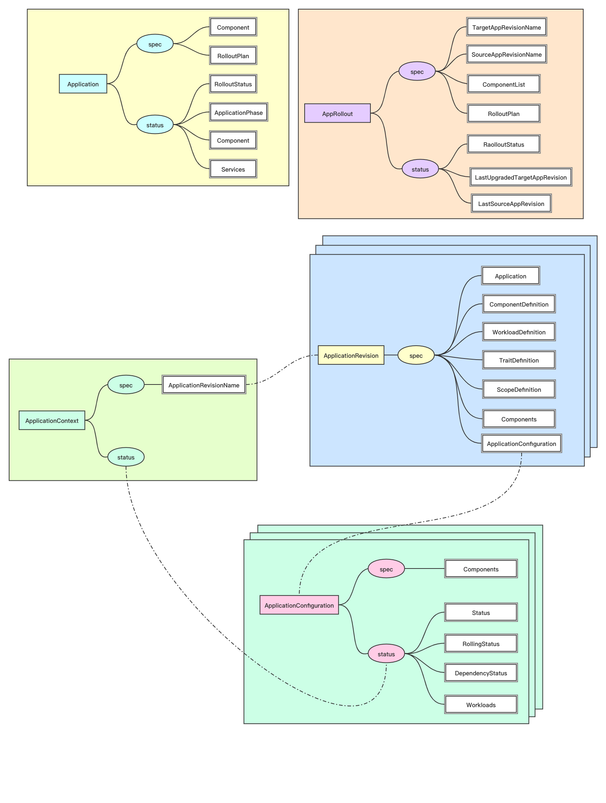
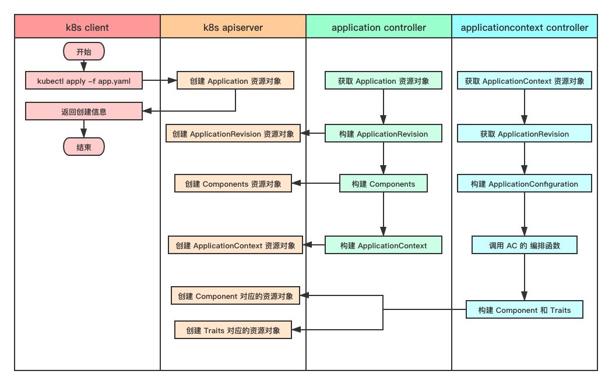

# kubevela 控制器逻辑

该文档主要用于探索kubevela 服务端（vela-core）中几个 controller 的代码逻辑，方便更好的理解kubevela的代码。

kubevela 版本： v1.0.0


> **建议**：
>
> - 了解 kubernetes CRD + controller 的开发模式
> - 了解 controller-runtime 开源项目


## 1. 基本概念


### CRD - Custom Resource Definition

在 kubernetes 中所有的内容都被抽象为资源（Resources），如 Pod，Service 和 Node等。同时，kubernetes 提供了自定义资源（Custom Resources) 来扩展 Kubernetes 的 API。而 CRD （Custom Resource Definition) 就是添加自定义资源（Custom resources) 的一种方式。


### kuberentes 的 controller

控制回路（control loop）是 kubernetes 项目中一个编排模式。controller 的主要的运行逻辑是：获取资源对象的实际运行状态和声明的期望状态，将资源对象的实际状态通过一系列操作变为期望状态。具体如下面代码所示：

```go
for {
  实际状态 := 获取集群中对象X的实际状态（Actual State）
  期望状态 := 获取集群中对象X的期望状态（Desired State）
  if 实际状态 == 期望状态{
    什么都不做
  } else {
    执行编排动作，将实际状态调整为期望状态
  }
}
```

因此，在理论上可以将 controller 的运行分为三步：

- 获取对象的实际状态
- 获取对象的期望状态
- 将实际对象转换为期望状态


## 2. kubevela 的部分 CRD

下图是中包含 kubevela 中五个重要的CRD资源对象，分别是：

- **Application**：是 kubevela 对于应用的抽象。
- **AppRollout**：用于实现应用版本之间的滚动发布等功能。
- **ApplicationContext**：用于记录当前运行的应用版本。
- **ApplicationRevision**：kubevela中每一次应用更新后会生成一个对应的新版本。可以利用 AppRollout实现版本之间的切换。
- **ApplicationConfiguration**：代表一个应用的实例，跟 ApplicationRevision 一一对应。

当然，kubevela中还有其他的CRD，如`ApplicationDeployment` ，本文中暂时不涉及。



<center><b>图 1 : kubevela 的部分 CRD 资源对象</b></center>


## 3. kubevela controller 中的代码逻辑


### 3.1 Application Controller


##### a. 获取 Application

```go
// pkg/controller/core.oam.dev/v1alpha2/application/application_controller.go
func (r *Reconciler) Reconcile(req ctrl.Request) (ctrl.Result, error) {
	app := new(v1beta1.Application)
	if err := r.Get(ctx, client.ObjectKey{
		Name:      req.Name,
		Namespace: req.Namespace,
	}, app); err != nil {
		...
	}
  ...
}
```


##### b. 利用 Application 构建中间状态 Appfile，然后再利用 Appfile 构建 ApplicationConfiguration 和 Components

```go
// Appfile describes application
type Appfile struct {
	Name         string  			// 对应 Application 的名称
	RevisionName string				// 对应 ApplicationRevision 的名称
	Workloads    []*Workload 	// 对应 Application 中的 Components
}
```

Appfile 是一个重要的中间状态，用来保存 Application 中的各个组件（Components）和当前应用对应的版本（ApplicationRevision）名称。

```go
// pkg/controller/core.oam.dev/v1alpha2/application/application_controller.go
func (r *Reconciler) Reconcile(req ctrl.Request) (ctrl.Result, error) {
  ...
  // 1. 构建解析器
	appParser := appfile.NewApplicationParser(r.Client, r.dm, r.pd)
	...
  // 2. 将 Application 转换为 Appfile
	generatedAppfile, err := appParser.GenerateAppFile(ctx, app.Name, app)
	...
  // 3. 创建 ApplicationRevision
  appRev, err := handler.GenerateAppRevision(ctx)
  ...
  // 4. 将 ApplicationRevision 与 Appfile 关联
  generatedAppfile.RevisionName = appRev.Name
  ...
  // 5. 利用 Appfile 构建 ApplicationConfiguration 和 Components
  ac, comps, err := appParser.GenerateApplicationConfiguration(generatedAppfile, app.Namespace)
  ...
}
```


##### c. 创建 ApplicationRevision 和 Components

```go
// pkg/controller/core.oam.dev/v1alpha2/application/application_controller.go
func (r *Reconciler) Reconcile(req ctrl.Request) (ctrl.Result, error) {
  ...
  // 创建 ApplicationRevision 和 Components
  if err := handler.apply(ctx, appRev, ac, comps); err != nil {
		...
	}
  ...
}
```


```go
// pkg/controller/core.oam.dev/v1alpha2/application/apply.go
func (h *appHandler) apply(ctx context.Context, appRev *v1beta1.ApplicationRevision, ac *v1alpha2.ApplicationConfiguration, comps []*v1alpha2.Component) error {
	...
  // 1. 遍历所有的 Component，并逐个创建
	for _, comp := range comps {
		...
		newComp := comp.DeepCopy()
		// 创建 Component
		revisionName, err := h.createOrUpdateComponent(ctx, newComp)
		...
	}
  ...
	// 2. 将 ApplicationConfiguration 和 Components 关联到 ApplicationRevision 中。
	h.FinalizeAppRevision(appRev, ac, comps)

  // 3. 创建 ApplicationRevision
	if err := h.createOrUpdateAppRevision(ctx, appRev); err != nil {
		return err
	}
	
  // 4. 判断是否直接创建 ApplicationContext
  // - 如果 Application 没有带有 "app.oam.dev/rollout-template: true" 的注解，并且没有发布计划 [RolloutPlan], 直接创建ApplicationContext
  // - 否则，暂不创建 ApplicationContext
	if _, exist := h.app.GetAnnotations()[oam.AnnotationAppRollout]; !exist && h.app.Spec.RolloutPlan == nil {
		...
		return h.createOrUpdateAppContext(ctx, owners)
	}
	...
}
```


##### 总结


<center><b>图 2 : Application Controller</b></center>


### 3.2  ApplicationContext Controller


##### a. 获取 ApplicationContext

```go
// pkg/controller/core.oam.dev/v1alpha2/applicationcontext/applicationcontext_controller.go
func (r *Reconciler) Reconcile(request reconcile.Request) (reconcile.Result, error) {
  // 获取到 ApplicationContext
	...
	appContext := &v1alpha2.ApplicationContext{}
	if err := r.client.Get(ctx, request.NamespacedName, appContext); err != nil {
		...
	}
	...
}
```


##### b. 根据 ApplicationContext 中的 ApplicationRevisionName 获取 ApplicationRevision

```go
// pkg/controller/core.oam.dev/v1alpha2/applicationcontext/applicationcontext_controller.go
func (r *Reconciler) Reconcile(request reconcile.Request) (reconcile.Result, error) {
  ...
  // 根据 appContext.Spec.ApplicationRevisionName 获取 ApplicationRevision 资源对象
  appRevision := &v1alpha2.ApplicationRevision{}
	key := types.NamespacedName{Namespace: appContext.Namespace, Name: appContext.Spec.ApplicationRevisionName}
	if err := r.client.Get(ctx, key, appRevision); err != nil {
		...
	}
  ...
}
```


##### c. 根据 ApplicationRevision 获取 ApplicationConfiguration，并创建 ApplicationConfiguration

```go
// pkg/controller/core.oam.dev/v1alpha2/applicationcontext/applicationcontext_controller.go
func (r *Reconciler) Reconcile(request reconcile.Request) (reconcile.Result, error) {
  ...
  // 1. 获取 ApplicationRevision 中嵌入的 ApplicationConfiguration 资源对象
  appConfig, err := util.RawExtension2AppConfig(appRevision.Spec.ApplicationConfiguration)
	...
  
  // 2. 根据 ApplicationContext 对 ApplicationConfiguration 进行更新
  appConfig.Status = appContext.Status
	appConfig.Name = appContext.Name
	appConfig.UID = appContext.UID
	appConfig.SetLabels(appContext.GetLabels())
	appConfig.SetAnnotations(appContext.GetAnnotations())
  
  // 3. 调用 ApplicationConfiguration 控制器中的 ACReconcile 函数
  // ACRenconcile 函数包含了一个 ApplicationConfiguration 的全部编排逻辑
  acReconciler := ac.NewReconciler(r.mgr, dm, r.log, ac.WithRecorder(r.record), ac.WithApplyOnceOnlyMode(r.applyMode))
	reconResult := acReconciler.ACReconcile(ctx, appConfig, r.log)
	appContext.Status = appConfig.Status
  ...
}
```


##### d. ApplicationConfiguration 的 ACReconcile 函数

```go
// pkg/congroller/core.oam.dev/v1alpha2/applicationconfiguration/applicationconfiguration.go
// ACReconcile contains all the reconcile logic of an AC, it can be used by other controller
func (r *OAMApplicationReconciler) ACReconcile(ctx context.Context, ac *v1alpha2.ApplicationConfiguration,
	log logging.Logger) (result reconcile.Result) {
	...
  // 1. 将 ApplicationConfiguration 渲染为多个 workloads
  workloads, depStatus, err := r.components.Render(ctx, ac)
  ...
  // 2. 创建所有的 workload
	if err := r.workloads.Apply(ctx, ac.Status.Workloads, workloads, applyOpts...); err != nil {
		...
	}
  // 3. gc 操作，删除 ApplicationConfiguratioin 中不存在 component 和 trait
  for _, e := range r.gc.Eligible(ac.GetNamespace(), ac.Status.Workloads, workloads) {
  	...
  }
  ...
}
```


##### 总结


<center><b>图 3 : ApplicationContext controller</b></center>


### 3.3 AppRollout Controller

##### a. 获取 AppRollout

```go
// pkg/controller/core.oam.dev/v1alpha2/applicationrollout/applicationrollout_controller.go
// Reconcile is the main logic of appRollout controller
func (r *Reconciler) Reconcile(req ctrl.Request) (res reconcile.Result, retErr error) {
  ...
  // 获取 AppRollout
  var appRollout v1beta1.AppRollout
  ...
  if err := r.Get(ctx, req.NamespacedName, &appRollout); err != nil {
		...
	}
  ...
}
```


##### b. 根据 AppRollout 获取两个版本的真实 workloads

```go
// pkg/controller/core.oam.dev/v1alpha2/applicationrollout/applicationrollout_controller.go
// Reconcile is the main logic of appRollout controller
func (r *Reconciler) Reconcile(req ctrl.Request) (res reconcile.Result, retErr error) {
  ...
  // 1. 获取将要进行滚动更新的两个版本的名称
  targetAppRevisionName := appRollout.Spec.TargetAppRevisionName
	sourceAppRevisionName := appRollout.Spec.SourceAppRevisionName
  
  // 2. 根据 sourceAppRevisionName 获取对应的 ApplicationRevision 和 ApplicationContext
  var sourceApRev *oamv1alpha2.ApplicationRevision
	var sourceApp *oamv1alpha2.ApplicationContext
	var err error
	if sourceAppRevisionName == "" {
		klog.Info("source app fields not filled, this is a scale operation")
		sourceApp = nil
	} else {
		sourceApRev, sourceApp, err = r.getSourceAppContexts(ctx,
			appRollout.Spec.ComponentList, appRollout.Status.RollingState, sourceAppRevisionName)
		...
	}
  
  // 3. 根据 targetAppRevisionName 获取对应的 ApplicationRevision 和 ApplicationContext
  targetAppRev, targetApp, err := r.getTargetApps(ctx, appRollout.Spec.ComponentList,
		appRollout.Status.RollingState, targetAppRevisionName)
  ...
  
  // 4. 根据 sourceApRev 和 targetAppRev 分别获取对应的真实 workloads
  targetWorkload, sourceWorkload, err := r.extractWorkloads(ctx, appRollout.Spec.ComponentList, targetAppRev, sourceApRev)
  ...
}
```


##### c. 利用 rolloutPlanController 完成滚动更新的过程

```go
// pkg/controller/core.oam.dev/v1alpha2/applicationrollout/applicationrollout_controller.go
// Reconcile is the main logic of appRollout controller
func (r *Reconciler) Reconcile(req ctrl.Request) (res reconcile.Result, retErr error) {
  ...
  // 构建 RolloutPlanController
  rolloutPlanController := rollout.NewRolloutPlanController(r, &appRollout, r.record,
		&appRollout.Spec.RolloutPlan, &appRollout.Status.RolloutStatus, targetWorkload, sourceWorkload)
  // 调用 Reconcile 函数进行编排，完成整个滚动更新过程
	result, rolloutStatus := rolloutPlanController.Reconcile(ctx)
	appRollout.Status.RolloutStatus = *rolloutStatus
  ...
}
```


##### 总结


<center><b>图 4 : AppRollout Controller</b></center>


## 4. 场景


### 4.1 直接创建 Application



<center><b>图 5 : 直接创建 Application</b></center>


### 4.2 利用 AppRollout 实现不同版本间的切换


<center><b>图 6 : 利用 Rollout 实现不同版本之间的切换</b></center>

