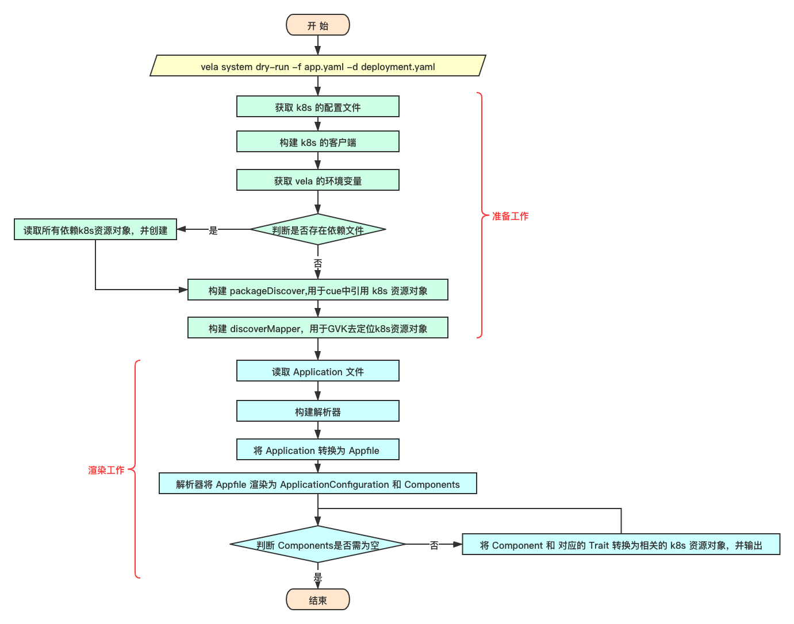

# vela system dry-run

该文档主要用于探索  `vela system dry-run` 命令背后的逻辑，进一步了解 kubevela 项目。

kubevela 版本：v1.0.0


## 1. 功能介绍

`vela system dry-run` 该命令可以模拟 kubevela 将 Application 渲染为 k8s 资源对象的功能，将渲染后的结果输出，是的使用者更加方便的定位bug。

```shell
# dry-run 命令
$ vela system dry-run --help
Dry Run an application, and output the K8s resources as result to stdout, only CUE template supported for now

Usage:
  vela system dry-run

Examples:
vela dry-run

Flags:
  -d, --definition string   specify a definition file or directory, it will automatically applied to the K8s cluster
  -f, --file string         application file name (default "./app.yaml")
  -h, --help                help for dry-run
```

通过上面的帮助信息可以发现，使用 `vela system dry-run`  时需要注意两个参数 `-f` 和 `-d` 。其中 `-f` 参数是需要被渲染的 `Application` 文件，`-d` 是可以是一个目录也可以是一个 definition 文件，用于提供渲染过程中需要的 componentdefinition 和 traitdefinition 文件。


## 2. 使用案例

`deployment.yaml`

```yaml
apiVersion: core.oam.dev/v1beta1
kind: ComponentDefinition
metadata:
  name: deployment
  namespace: default
  annotations:
    definition.oam.dev/description: A Deployment provides declarative updates for Pods and ReplicaSets
spec:
  workload:
    definition:
      apiVersion: apps/v1
      kind:       Deployment
  schematic:
    cue:
      template: |
        output: {
          apiVersion: "apps/v1"
          kind:       "Deployment"
          spec: {
              selector: matchLabels: {
                  "app.oam.dev/component": context.name
              }
              template: {
                  metadata: labels: {
                      "app.oam.dev/component": context.name
                  }
                  spec: {
                      containers: [{
                          name:  context.name
                          image: parameter.image
                          ports: [{
                              containerPort: parameter.port
                          }]   
                      }]
              }
              }
          }
        }
        parameter: {
          // +usage=Which image would you like to use for your service
          // +short=i
          image: string

          // +usage=Which port do you want customer traffic sent to
          // +short=p
          port: *80 | int   
        }
```


`app.yaml`

```yaml
apiVersion: core.oam.dev/v1beta1
kind: Application
metadata:
  name: test
  namespace: default
spec:
  components:
  - name: test
    properties:
      image: nginx
    type: deployment
```


```shell
$ vela system dry-run -f app.yaml -d deployment.yaml
Updating:  core.oam.dev/v1beta1, Kind=ComponentDefinition in default
---
# Application(test) -- Comopnent(test)
---

apiVersion: apps/v1
kind: Deployment
metadata:
  labels:
    app.oam.dev/appRevision: ""
    app.oam.dev/component: test
    app.oam.dev/name: test
    workload.oam.dev/type: deployment
spec:
  selector:
    matchLabels:
      app.oam.dev/component: test
  template:
    metadata:
      labels:
        app.oam.dev/component: test
    spec:
      containers:
      - image: nginx
        name: test
        ports:
        - containerPort: 80
---
```


## 3. 代码逻辑


### 3.1 参数结构体

在看 `vela system dry-run` 具体的代码逻辑之前，需要了解两个重要的参数结构体 `Args` 和 `dryRunOptions`。

`Args` 结构体代表 `controller-runtime` 客户端需要的一些关键参数， [controller-runtime](https://github.com/kubernetes-sigs/controller-runtime) 项目是一个构建 kubernetes 控制器的 go 语言库的集合。

`dryRunOptions` 结构体代表 `vela system dry-run` 命令执行时，通过参数传入的信息。

#### Args

```go
// pkg/utils/common/args.go
// Args is args for controller-runtime client
type Args struct {
	Config *rest.Config
	Schema *runtime.Scheme
	Client client.Client
	dm     discoverymapper.DiscoveryMapper
	pd     *definition.PackageDiscover
}
```

`Args` 结构体在 kubevela 中是一个非常基础的结构体，其中五个参数的功能如下：

- **Config** 代表 kubernetes 客户端初始化需要的配置文件。
- **Schema** 代表 Kubernetes 资源对象的范式，用于 GVR/GVK 和 Go 结构体之间的转换。
- **Client**  代表 Kubernetes 的客户端。
- **dm** 用于根据 GVK 找到对应的 kuberentes 资源对象。
- **pd** 用于将 kubernetes 中的资源对象作为 cue 的模板库，方便在 cue 中引用。

同时 Args 提供四个方法：

- **SetConfig** 方法用于设置 kubernetes 配置文件。具体可以参考 `client-go` 项目。
- **GetClient** 方法用于获取 kubernetes 客户端，便于操作 kubernetes 资源对象。
- **GetDiscoveryMapper** 方法用于获取  discoverMapper，便于通过 GVK 定位 kubernetes 资源对象。
- **GetPackageDiscover** 方法用于获取  packageDiscover，方便在 cue 中引用原生的 k8s 资源对象。


#### dryRunOptions

```go
// references/cli/dry-run.go
// dryRunOptions 是 dry-run 命令
type dryRunOptions struct {
	cmdutil.IOStreams
	applicationFile string
	definitionFile  string
}
```

`dryRunOptions` 结构体主要用于保存 `vela system dry-run` 命令执行过程中需要的基本信息：

- **applicationFile** 代表需要的渲染的 Application 文件。
- **definitionFile** 代表渲染 Application 需要的对应的 componentdefinition 和 traitdefinition 文件，该参数可以是一个文件名，也可以是一个目录。


#### NewDryRunCommand 函数

```go
// references/cli/dry-run.go
// NewDryRunCommand creates `dry-run` command
func NewDryRunCommand(c common.Args, ioStreams cmdutil.IOStreams) *cobra.Command {
  o := &dryRunOptions{IOStreams: ioStreams}
  ...
  cmd.Flags().StringVarP(&o.applicationFile, "file", "f", "./app.yaml", "application file name")
  cmd.Flags().StringVarP(&o.definitionFile, "definition", "d", "", "specify a definition file or directory, it will automatically applied to the K8s cluster")
  cmd.SetOut(ioStreams.Out)
  return cmd
}
```

该函数是 `vela system dry-run` 命令执行对应的函数， `Args` 结构体在调用该函数的时候传入。同事，在该函数调用后，会首先对 `dryRunOptions` 结构体进行初始化，并保存通过命令行参数传入的值。


### 3.2 渲染前的准备工作

##### Args 相关

```go
// references/cli/dry-run.go
func NewDryRunCommand(c common.Args, ioStreams cmdutil.IOStreams) *cobra.Command {
  ...
  cmd := &cobra.Command{
    ...
    PersistentPreRunE: func(cmd *cobra.Command, args []string) error {
      // 1. 调用 Args 的 SetConfig 方法，设置 Config 字段
      return c.SetConfig()
    },
    RunE: func(cmd *cobra.Command, args []string) error {
      // 2. 获取 k8s 客户端
      newClient, err := c.GetClient()
      ...
      // 3. cue 的 packageDiscover
      pd, err := c.GetPackageDiscover()
      ...
      // 4. discoverymapper
      dm, err := discoverymapper.New(c.Config)
      ...
    }
  }
  ...
}
```


##### dryRunOptions 相关

```go
// references/cli/dry-run.go
func NewDryRunCommand(c common.Args, ioStreams cmdutil.IOStreams) *cobra.Command {
  ...
  cmd := &cobra.Command{
    ...
    RunE: func(cmd *cobra.Command, args []string) error {
      ...
      // 1. 如果依赖的文件不为空，就创建对应的资源对象
      if o.definitionFile != "" {
        // 如果 definitionFile 是一个yaml文件，则读取该文件
        // 如果 definitionFile 是一个目录，则读取该目录下的所有 yaml | yml 文件
        objs, err := ReadObjectsFromFile(o.definitionFile)
        if err != nil {
          return err
        }
        // 为k8s资源对象设定命名空间
        for _, obj := range objs {
          if obj.GetNamespace() == "" {
            obj.SetNamespace(velaEnv.Namespace)
          }
        }
        // 利用 Args 结构体构建的 k8s 客户端创建资源对象
        if err = appfile2.CreateOrUpdateObjects(context.TODO(), newClient, objs); err != nil {
          return err
        }
      }
      ...
      // 2. 读取指定的 Application 文件
      app, err := readApplicationFromFile(o.applicationFile)
      ...
    }
  }
  ...
}
```

 

### 3.3 构建解析器并将 application 渲染为 kubernetes 资源对象

```go
// references/cli/dry-run.go
func NewDryRunCommand(c common.Args, ioStreams cmdutil.IOStreams) *cobra.Command {
  ...
  cmd := &cobra.Command{
    ...
    RunE: func(cmd *cobra.Command, args []string) error {
      ...
      // 1. 利用 k8s 客户端，discoverMapper 和 cue 的 packageDiscover 构建解析器
      parser := appfile.NewApplicationParser(newClient, dm, pd)
      ...
      // 2. 将 Application 文件转换为 appfile
      appFile, err := parser.GenerateAppFile(ctx, app.Name, app)
      ...
      // 3. 利用解析器将 appfile 渲染为 applicationconfiguration 和 component
      ac, comps, err := parser.GenerateApplicationConfiguration(appFile, app.Namespace)
      ...
      // 4. 循环遍历所有的 Component
      for _, c := range ac.Spec.Components {
        // 将 Component 解析为对应的 k8s 的 yaml 文件，并输出
        result, err := yaml.Marshal(components[c.ComponentName])
        ...
        // 将 Traits 解析为对应的 k8s 的 yaml 文件，并输出
        for _, t := range c.Traits {
          result, err := yaml.Marshal(t.Trait)
          ...
        }
        ...
      }
      ...
    } 
  }
  ...
}
```


### 3.4 总结




## 4. 注意事项


### 4.1 appfile

在 `references/cli/dryrun.go` 文件中，出现了两个 appfile 导入包，分别是：

- `"github.com/oam-dev/kubevela/pkg/appfile"`
- `appfile2 "github.com/oam-dev/kubevela/references/appfile"`


在 `github.com/oam-dev/kubevela/references/appfile` 的  `api/appfile.go` 文件夹中有一个 `AppFile`结构体：

```go
// AppFile defines the spec of KubeVela Appfile
type AppFile struct {
	Name       string             `json:"name"`
	CreateTime time.Time          `json:"createTime,omitempty"`
	UpdateTime time.Time          `json:"updateTime,omitempty"`
	Services   map[string]Service `json:"services"`
	Secrets    map[string]string  `json:"secrets,omitempty"`

	configGetter config.Store
	initialized  bool
}
```

该结构体是 vela 客户端用来存储 `vela up` 命令读取的 appfile 文件，用于在命令行中将其渲染为 Application，并在 k8s 集群中创建 Application 资源对象。


在 `"github.com/oam-dev/kubevela/pkg/appfile"` 的 `parser.go` 文件中也有一个 `Appfile` 的结构体:

```go
// Appfile describes application
type Appfile struct {
	Name         string
	RevisionName string
	Workloads    []*Workload
}
```

该结构体在 kubevela 的服务端程序（即 vela-core ）中使用，是监听到 Application 对象被创建之后，将 Application 对象渲染为对应的 ApplicationConfiguration 和 Component 这一过程中的一个中间状态。