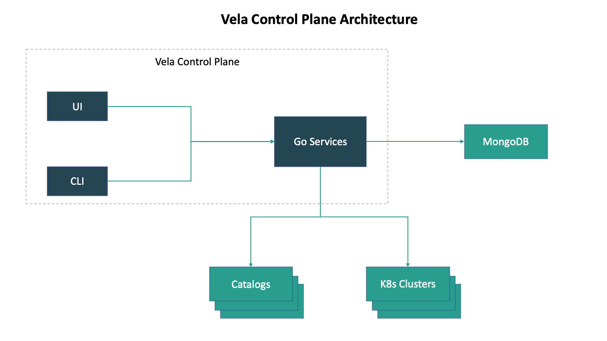

2021/05/26

# velacp

velacp (KubeVela control plane) 是 KubeVela 的新控制面板，目前正在构建中。



<center><b>Vela Control Plane Architecture</b></center>


## 1. velacp 的主要管理对象

### Application

```go
type Application struct {
	...

	Name      string `protobuf:"bytes,1,opt,name=name,proto3" json:"name,omitempty"`
	Namespace string `protobuf:"bytes,2,opt,name=namespace,proto3" json:"namespace,omitempty"`
	Desc      string `protobuf:"bytes,3,opt,name=desc,proto3" json:"desc,omitempty"`
	// Unix time of the last time when the cluster is updated.
	UpdatedAt   int64            `protobuf:"varint,4,opt,name=updated_at,json=updatedAt,proto3" json:"updated_at,omitempty"`
	Components  []*ComponentType `protobuf:"bytes,5,rep,name=components,proto3" json:"components,omitempty"`
	ClusterName string           `protobuf:"bytes,6,opt,name=clusterName,proto3" json:"clusterName,omitempty"`
}
```

Application 的主要功能是在指定的集群中创建 KubeVela 的一个 Application  资源对象。


### Cluster

```go
type Cluster struct {
	...

	Name string `protobuf:"bytes,1,opt,name=name,proto3" json:"name,omitempty"`
	Desc string `protobuf:"bytes,2,opt,name=desc,proto3" json:"desc,omitempty"`
	// Unix time of the last time when the cluster is updated.
	UpdatedAt  int64  `protobuf:"varint,3,opt,name=updated_at,json=updatedAt,proto3" json:"updated_at,omitempty"`
	Kubeconfig string `protobuf:"bytes,4,opt,name=kubeconfig,proto3" json:"kubeconfig,omitempty"`
}
```

Cluster 的主要功能是存储不同集群的 config 配置文件。


### Install

```go
type InstallVela struct {
	...

	Cluster  string `protobuf:"bytes,1,opt,name=cluster,proto3" json:"cluster,omitempty"`
	Helmrepo string `protobuf:"bytes,2,opt,name=helmrepo,proto3" json:"helmrepo,omitempty"`
	Version  string `protobuf:"bytes,3,opt,name=version,proto3" json:"version,omitempty"`
}
```

Install 的主要功能是在指定的集群安装指定版本的 KubeVela。


### Catalog

Catalog 的主要功能是同步指定仓库中的 `ComponentDefinition` 和 `TraitDefinition` 到指定的集群。


## 2 技术栈

### 前端

- React
- Ant Design Pro


### 后端

- web 框架：echo
- 数据库：mongo
- golang库：cobra、kube-core-api、helm.sh、k8s.io、protobuf、zap