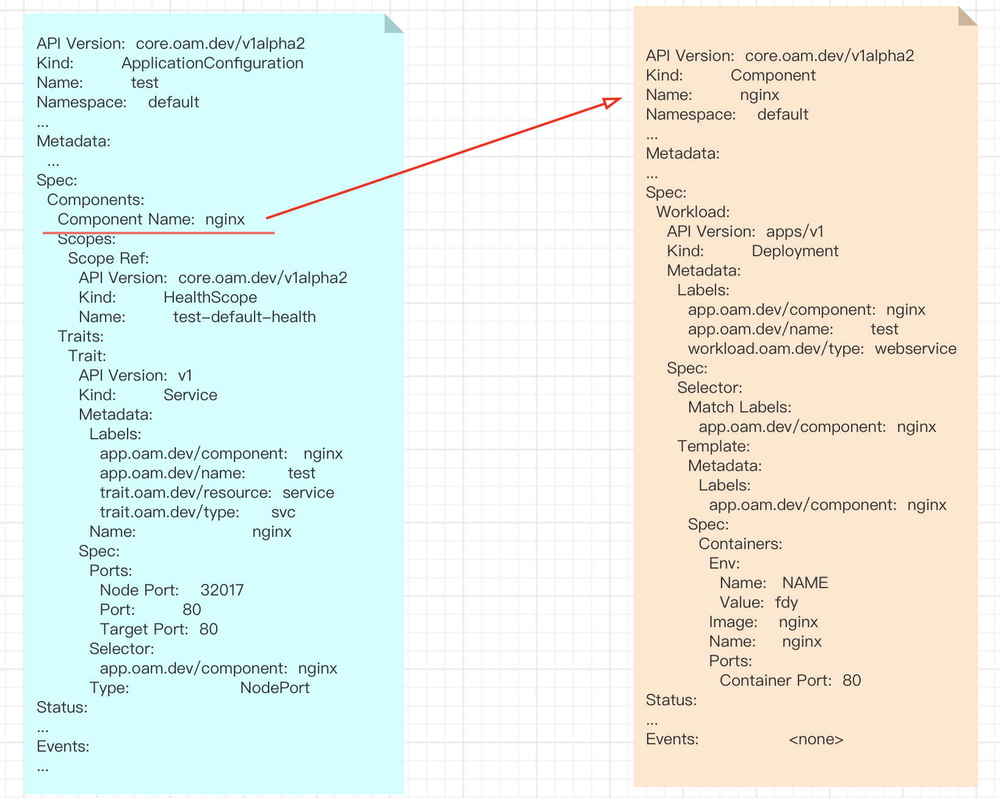

# vela up

该文档主要目的是探索 `kubevela` 如何将一个 `appfile` 文件转换为k8s中特定的资源对象。

该过程总的来说分为两个阶段：

1. `appfile` 转为 k8s 中的 `application`
2. `application` 转换为对应的 k8s 资源对象  


```yaml
# vela.yaml
name: test
services:
  nginx:
    type: webservice
    image: nginx
    env:
    - name: NAME
      value: kubevela

    # svc trait
    svc:
      type: NodePort
      ports:
      - port: 80
        nodePort: 32017
```


利用 `vela up` 命令可以完成部署。


## 1. vela up 命令


>**建议**
>
>- 在看 vela 命令行工具代码之前，先去简单了解一下 [cobra](https://github.com/spf13/cobra) 框架


```go
// references/cli/up.go
// NewUpCommand will create command for applying an AppFile
func NewUpCommand(c types.Args, ioStream cmdutil.IOStreams) *cobra.Command {
	cmd := &cobra.Command{
		Use:                   "up",
		DisableFlagsInUseLine: true,
		Short:                 "Apply an appfile",
		Long:                  "Apply an appfile",
		Annotations: map[string]string{
			types.TagCommandType: types.TypeStart,
		},
		PersistentPreRunE: func(cmd *cobra.Command, args []string) error {
			return c.SetConfig()
		},
		RunE: func(cmd *cobra.Command, args []string) error {
			velaEnv, err := GetEnv(cmd)
			if err != nil {
				return err
			}
			kubecli, err := c.GetClient()
			if err != nil {
				return err
			}

			o := &common.AppfileOptions{
				Kubecli: kubecli,
				IO:      ioStream,
				Env:     velaEnv,
			}
			filePath, err := cmd.Flags().GetString(appFilePath)
			if err != nil {
				return err
			}
			return o.Run(filePath, velaEnv.Namespace, c)
		},
	}
	cmd.SetOut(ioStream.Out)

	cmd.Flags().StringP(appFilePath, "f", "", "specify file path for appfile")
	return cmd
}
```

上面源码展示的是 vela up 命令的入口。

在 `PresistentPreRunE` 函数中，通过调用 `c.SetConfig()`  完成 kuberentes 配置信息 `kubeconfig` 的注入。

在 `RunE` 函数中：

- 首先，获取 vela 的 env 变量，`velaEnv.Namespace` 对应 kubernetes 的命名空间。
- 其次，获取 kubernetes 的客户端， `kubectl`。
- 接着，利用 kubernetes 客户端和 vleaEnv  来构建渲染 Appfile 需要的 `AppfileOptions`。
- 最后，调用 `o.Run(filePath, velaEnv.Namespace, c)`。
  - 该函数需要三个参数，其中 filePath 用于指定 appfile 的位置，velaEnv.Namespace 和 c 用来将渲染后的 Application 创建到指定命名空间。
    - filePath: appfile 的路径
    - velaEnv.Namespace：对应  k8s 的 namespace
    - c：k8s  客户端


## 2. 如何将一个 appfile 转为 kubernetes 中的 Application

- 起点：appfile
- 终点：applicatioin
- 路径：appfile -> application (services -> component)
  - comp[workload, traits]


### 2.1 起点：AppFile

```go
// references/appfile/api/appfile.go
// AppFile defines the spec of KubeVela Appfile
type AppFile struct {
	Name       string             `json:"name"`
	CreateTime time.Time          `json:"createTime,omitempty"`
	UpdateTime time.Time          `json:"updateTime,omitempty"`
	Services   map[string]Service `json:"services"`
	Secrets    map[string]string  `json:"secrets,omitempty"`

	configGetter config.Store
	initialized  bool
}

// NewAppFile init an empty AppFile struct
func NewAppFile() *AppFile {
	return &AppFile{
		Services:     make(map[string]Service),
		Secrets:      make(map[string]string),
		configGetter: &config.Local{},
	}
}
```


```go
// references/appfile/api/service.go
// Service defines the service spec for AppFile, it will contain all related information including OAM component, traits, source to image, etc...
type Service map[string]interface{}
```


上面两段代码是 `AppFile` 在客户端的声明，vela 会将指定路径的 yaml 文件读取后，赋值给一个 AppFile。


```go
// references/appfile/api/appfile.go
// LoadFromFile will read the file and load the AppFile struct
func LoadFromFile(filename string) (*AppFile, error) {
	b, err := ioutil.ReadFile(filepath.Clean(filename))
	if err != nil {
		return nil, err
	}
	af := NewAppFile()
	// Add JSON format appfile support
	ext := filepath.Ext(filename)
	switch ext {
	case ".yaml", ".yml":
		err = yaml.Unmarshal(b, af)
	case ".json":
		af, err = JSONToYaml(b, af)
	default:
		if json.Valid(b) {
			af, err = JSONToYaml(b, af)
		} else {
			err = yaml.Unmarshal(b, af)
		}
	}
	if err != nil {
		return nil, err
	}
	return af, nil
}
```


下面为读取 `vela.yaml` 文件后，加载到 AppFile 中的数据：

```yaml
# vela.yaml
name: test
services:
  nginx:
    type: webservice
    image: nginx
    env:
    - name: NAME
      value: kubevela

    # svc trait
    svc:
      type: NodePort
      ports:
      - port: 80
        nodePort: 32017
```


```shell
Name: test
CreateTime: 0001-01-01 00:00:00 +0000 UTC
UpdateTime: 0001-01-01 00:00:00 +0000 UTC
Services： map[
             nginx: map[
               env: [map[name: NAME value: kubevela]] 
               image: nginx 
               svc: map[ports: [map[nodePort: 32017 port: 80]] type: NodePort] 
               type: webservice
            ]
          ]
Secrets    map[]
configGetter: 0x447abd0 
initialized: false
```


### 2.2 终点：application

```go
// apis/core.oam.dev/application_types.go
type Application struct {
	metav1.TypeMeta   `json:",inline"`
	metav1.ObjectMeta `json:"metadata,omitempty"`

	Spec   ApplicationSpec `json:"spec,omitempty"`
	Status AppStatus       `json:"status,omitempty"`
}

// ApplicationSpec is the spec of Application
type ApplicationSpec struct {
	Components []ApplicationComponent `json:"components"`

	// TODO(wonderflow): we should have application level scopes supported here

	// RolloutPlan is the details on how to rollout the resources
	// The controller simply replace the old resources with the new one if there is no rollout plan involved
	// +optional
	RolloutPlan *v1alpha1.RolloutPlan `json:"rolloutPlan,omitempty"`
}
```

上面代码，为 Application 的声明，结合 `.vela/deploy.yaml` （见下面代码），可以看出，要将一个 `AppFile`  渲染为 `Application` 主要就是将 `AppFile`  的 `Services`  转化为`Application` 的` Components`。

```yaml
# .vela/deploy.yaml
apiVersion: core.oam.dev/v1alpha2
kind: Application
metadata:
  creationTimestamp: null
  name: test
  namespace: default
spec:
  components:
  - name: nginx
    scopes:
      healthscopes.core.oam.dev: test-default-health
    settings:
      env:
      - name: NAME
        value: kubevela
      image: nginx
    traits:
    - name: svc
      properties:
        ports:
        - nodePort: 32017
          port: 80
        type: NodePort
    type: webservice
status: {}
```


### 2.3 路径： Services -> Components

结合 1.1 和 1.2 可以看出，将 Appfile 转化为 Application 主要是将  Services  渲染为 Components。


```go
// references/appfile/api/appfile.go
// BuildOAMApplication renders Appfile into Application, Scopes and other K8s Resources.
func (app *AppFile) BuildOAMApplication(env *types.EnvMeta, io cmdutil.IOStreams, tm template.Manager, silence bool) (*v1alpha2.Application, []oam.Object, error) {
	...
	servApp := new(v1alpha2.Application)
	servApp.SetNamespace(env.Namespace)
	servApp.SetName(app.Name)
	servApp.Spec.Components = []v1alpha2.ApplicationComponent{}
	for serviceName, svc := range app.GetServices() {
		...
    // 完成 Service 到 Component 的转化
		comp, err := svc.RenderServiceToApplicationComponent(tm, serviceName)
		if err != nil {
			return nil, nil, err
		}
		servApp.Spec.Components = append(servApp.Spec.Components, comp)
	}
	servApp.SetGroupVersionKind(v1alpha2.SchemeGroupVersion.WithKind("Application"))
	auxiliaryObjects = append(auxiliaryObjects, addDefaultHealthScopeToApplication(servApp))
	return servApp, auxiliaryObjects, nil
}
```


上面的代码是 vela 将 Appfile  转化为 Application 代码实现的位置。其中 `comp, err := svc.RenderServiceToApplicationComponent(tm, serviceName)` 完成 Service  到  Component 的转化。


```go
// references/appfile/api/service.go
// RenderServiceToApplicationComponent render all capabilities of a service to CUE values to KubeVela Application.
func (s Service) RenderServiceToApplicationComponent(tm template.Manager, serviceName string) (v1alpha2.ApplicationComponent, error) {

	// sort out configs by workload/trait
	workloadKeys := map[string]interface{}{}
	var traits []v1alpha2.ApplicationTrait

	wtype := s.GetType()
	comp := v1alpha2.ApplicationComponent{
		Name:         serviceName,
		WorkloadType: wtype,
	}

	for k, v := range s.GetApplicationConfig() {
    // 判断是否为 trait
		if tm.IsTrait(k) {
			trait := v1alpha2.ApplicationTrait{
				Name: k,
			}
			....
      // 如果是 triat 加入 traits 中
			traits = append(traits, trait)
			continue
		}
		workloadKeys[k] = v
	}

	// Handle workloadKeys to settings
	settings := &runtime.RawExte nsion{}
	pt, err := json.Marshal(workloadKeys)
	if err != nil {
		return comp, err
	}
	if err := settings.UnmarshalJSON(pt); err != nil {
		return comp, err
	}
	comp.Settings = *settings

	if len(traits) > 0 {
		comp.Traits = traits
	}

	return comp, nil
}
```


#### 2.4 总结

执行 `vela up` 命令，渲染 appfile 为 Application，将数据写入到 `.vela/deploy.yaml` 中，并在 k8s 中创建。


## 3. Application 是如何转换为对应 k8s 资源对象

- 起点：Application
- 中点：ApplicationConfiguration, Component
- 终点：Deployment, Service
- 路径：
  - application_controller
  - applicationconfiguration_controller


> **建议**：
>
> 了解一下内容：
>
> - client-to
> - controller-runtime
> - operator


### 3.1 Application

```shell
# 获取集群中的 Application
$ kubectl get application
NAMESPACE   NAME   AGE
default     test   24h
```


### 3.2 ApplicationConfiguration 和  Component

```shell
# 获取 ApplicationConfiguration 和 Component
$ kubectl get ApplicationConfiguration,Component
NAME                                         AGE
applicationconfiguration.core.oam.dev/test   24h

NAME                           WORKLOAD-KIND   AGE
component.core.oam.dev/nginx   Deployment      24h
```


ApplicationiConfiguration 中以名字的方式引入 Component




### 3.3 application controller

##### 基本逻辑：

- 获取一个 Application 资源对象
- 将 Application 资源对象渲染为  ApplicationConfiguration 和 Component
- 创建 ApplicationConfiguration 和 Component 资源对象


##### 代码：

```go
// pkg/controller/core.oam.dev/v1alpha2/application/application_controller.go

// Reconcile process app event
func (r *Reconciler) Reconcile(req ctrl.Request) (ctrl.Result, error) {
	ctx := context.Background()
	applog := r.Log.WithValues("application", req.NamespacedName)
  
  // 1. 获取 Application
	app := new(v1alpha2.Application)
	if err := r.Get(ctx, client.ObjectKey{
		Name:      req.Name,
		Namespace: req.Namespace,
	}, app); err != nil {
		...
	}

	...

  // 2. 将 Application 转换为 ApplicationConfiguration 和 Component
	handler := &appHandler{r, app, applog}
	...
	appParser := appfile.NewApplicationParser(r.Client, r.dm)
	...
	appfile, err := appParser.GenerateAppFile(ctx, app.Name, app)
	...
	ac, comps, err := appParser.GenerateApplicationConfiguration(appfile, app.Namespace)
	...
  
  // 3. 在集群中创建 ApplicationConfiguration 和 Component 
	// apply appConfig & component to the cluster
	if err := handler.apply(ctx, ac, comps); err != nil {
		applog.Error(err, "[Handle apply]")
		app.Status.SetConditions(errorCondition("Applied", err))
		return handler.handleErr(err)
	}

	...
	return ctrl.Result{}, r.UpdateStatus(ctx, app)
}
```


### 3.4 applicationconfiguration controller

##### 基本逻辑：

- 获取 ApplicationConfiguration 资源对象
- 循环遍历，获取每一个 Component 并将 workload 和 trait 渲染为对应的 k8s 资源对象
- 创建对应的 k8s 资源对象


##### 代码：

```go
// pkg/controller/core.oam.dev/v1alpha2/applicationcinfiguratioin/applicationconfiguratioin.go

// Reconcile an OAM ApplicationConfigurations by rendering and instantiating its
// Components and Traits.
func (r *OAMApplicationReconciler) Reconcile(req reconcile.Request) (reconcile.Result, error) {
	...
	ac := &v1alpha2.ApplicationConfiguration{}
  // 1. 获取 ApplicationConfiguration
	if err := r.client.Get(ctx, req.NamespacedName, ac); err != nil {
		...
	}
	return r.ACReconcile(ctx, ac, log)
}

// ACReconcile contains all the reconcile logic of an AC, it can be used by other controller
func (r *OAMApplicationReconciler) ACReconcile(ctx context.Context, ac *v1alpha2.ApplicationConfiguration,
	log logging.Logger) (result reconcile.Result, returnErr error) {
	
  ...
  // 2. 渲染
  // 此处 workloads 包含所有Component对应的的 workload 和 tratis 的 k8s 资源对象
	workloads, depStatus, err := r.components.Render(ctx, ac)
	...
	
	applyOpts := []apply.ApplyOption{apply.MustBeControllableBy(ac.GetUID()), applyOnceOnly(ac, r.applyOnceOnlyMode, log)}
  
  // 3. 创建 workload 和 traits 对应的 k8s 资源对象
	if err := r.workloads.Apply(ctx, ac.Status.Workloads, workloads, applyOpts...); err != nil {
		...
	}
	
  ...

	// the defer function will do the final status update
	return reconcile.Result{RequeueAfter: waitTime}, nil
}
```


### 3.5 总结

当vela up 将一个 `AppFile` 渲染为一个 `Application` 后，后续的流程由 `application controller` 和  `applicationconfiguration controller`  完成。


